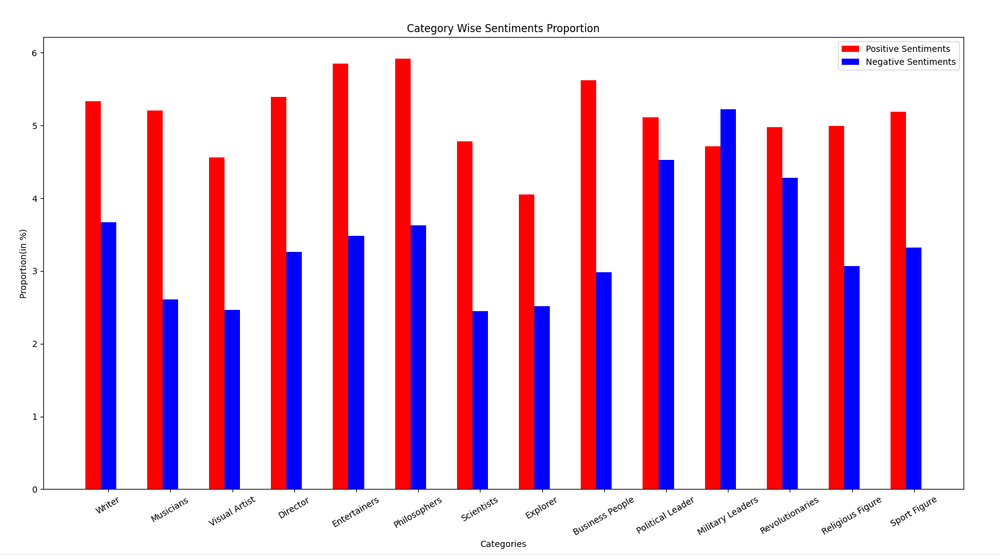
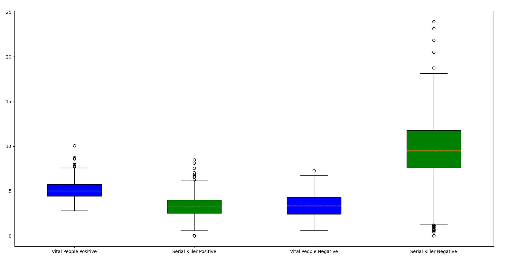

# Wikipedia NLP Project-Python
Data Science project based on Wikipedia Data for Data Analysis and Natural Language Processing using Python. 

A personal project made for practising and learning basics of Natural Language Processing and Data Analytics. 

### Requirements to run and test the project:

To run this project, you will need Python3+, pip and Git installed on the system. 

The reference links are provided below.

> **Python:**
  https://www.python.org/downloads/
  
> **pip:**
  https://pypi.org/project/pip/

> **Git:**
  https://git-scm.com/downloads
	
The necessary libraries and packages are specified in the **requirements.txt** file and will be validated in the below steps


## Process for acquiring the results: 

  * **Step 1:**
  Create a local directory in your machine where you want to pull the git project and clone the project by running the below command from cmd 
  (Make sure that you are in the newly created directory first!):
  
  	```git clone https://github.com/AjayTomar3342/Wikipedia_NLP_Project_Python```

  * **Step 2:**
  From cmd, move into the main folder of the cloned project
  
 	 ```cd Wikipedia_NLP_Project_Python```

  * **Step 3:**
  Execute the below commands to meet the pre-requisites to execute the code
  
  ```  	
      Unix/macOS
      python -m pip install -r requirements.txt

      Windows
      py -m pip install -r requirements.txt
  ```

  
  * **Step 4:**
  Execute the below commands to run the code from cmd
  
  ``` 
      Unix/macOS
      python main.py

      Windows
      %run main.py
  ```
  
  
## Alternative Process for acquiring the results(Backup):

For quick running of program, PyCharm use is suggested as it has good controls for removing manual steps to pull a repository and get it running.

Steps are:

  * **Step 1:**
  Make sure one is signed in on Github in Pycharm
  
  * **Step 2:**
  Open a new project
  
  * **Step 3:**
  Go to VCS Option on the Top Horizontal Options Bar
  
  * **Step 4:**
  Select Enable Version Control Integration Control inside VCS if not done already
  
  * **Step 5:**
  After checking the previous option on, select Checkout from Version Control and select Git
  
  * **Step 6:**
  In the new pop up window, include the link of the github repository you are trying to pull.
  Subsequently in the same pop up window, select an appropriate directory where the  project will be pulled.
  
  * **Step 7:**
  Select clone option to start the pulling process.
  
  * **Step 8:**
  Select option to start the pulled project in New Window or This window as per your personal preference.
  
  * **Step 9:**
  After this the project will be up and running and requirements.txt file will automatically install required libraries. Run the file main.py from Root Folder to get the results

This is a quick process to start the testing of GitHub project taken from the Official Jet Brains Website. We have tried this with several PC’s and are confident that this will not give any errors.

> **Link to Above Process Video:**
  https://www.youtube.com/watch?v=ukbvdF5wqPQ&feature=emb_title
  
  
  **NOTE:** 
Since, the libraries used in the project are updated by the original developers regularly, some function/functions may not run as expected. This project will be regularly updated as per the updated libraries requirement, but if project does not run at any give time when you pull the project, it may be due to the library change, rather than a coding issue. This repository is last updated as per latest libraries on 27/08/2021

## Procedure followed in the Project:

   * **Step 1:**
   Data Scraping using Beautiful Soup done separately for 500 Serial Killer Wikipedia Articles(https://en.wikipedia.org/wiki/List_of_serial_killers_by_number_of_victims) and 490 Vital People(https://en.wikipedia.org/wiki/Wikipedia:Vital_people) in links_scraping.py . Wikipedia article links for each of these type of people are scraped and stored into an excel file for further process. 
   
   * **Step 2:**
   After removing the stop words from the wikipedia articles of both Vital People and Serial Killers, sentiment analysis(using NLTK library) of the whole individual articles are done and a percentage of positive, neutral and negative sentiment words is found. This step is done in the positive_and_negative_words.py file. 
   
   * **Step 3:**
   The result of previous step is also visualized to test the hypothesis that serial killers have more negative sentiment words written about them when compared to Vital People. This hypothesis is testes using Kolmogorov-Smirnov Test. This step is performed in the analysis_and_visualization_of_sentiments_count.py file. 
  
   * **Step 4:**
   In the last part of the project, other analysis based on the Wikipedia data are done such as comparing lengths of articles of vital people vs. serial killers and finding most dominant words in the two above mentioned categories. A wordmap is made in the other_analysis.py file.  

  **NOTE:** 
All csv files made and used in the above steps are present in the Data_Files folder.

## Results:

Visualization and Hypothesis test results are shown below. 

### Visualization Results: 

All these analysis are done using both Python and Power BI. Some of the visuals are shown below: 

 
Vital People across the history of mankind have different categories. Here, the difference between positive and negative sentiments proportion is shown. Philosophers have the highest positive sentiment proportion and military leaders have highest negative proportions. 
 
Here, the positive words proportion is compared article wise. It's apparent that serial killers have significant less proportion(by 3-4%) than vital people. 

Here, the negative words proportion is compared article wise. It's clear that serial killers have significant high proportion(10-12%) than vital people. 

Here, using boxplots, overall picture of difference in terms of positive and negative proportion is shown for both serial killers and vital people. This visual also confirms the results we acquired from other visuals and our hypothesis.

Above visuals are taken from Python's matplotlib library results. 

### Hypothesis Results:

Kolmogorov Smirnov Test results for the two categories based on their positive and negative sentiment words proportion are as follows:  

a.) Positive Sentiment Words: P-Value = 4.122658641887565e-100, Statistic = 0.6433877551020408

b.) Negative Sentiment Words: P-Value = 3.7347910671380056e-198, Statistic = 0.8429387755102041

To understand the above terms, one needs to know that the smaller the P-Value is, the bigger effect is between the two proprotions which are compared. Here, this shows that there is a high different between proportion of positive sentiments words between Vital People and Serial Killer and in case of Negative sentiment proportion, the difference is even double than the positive proportion. 

The Kolmogorov Smirnov Statistic quantifies the distance between the empirical distribution function of the two samples. So, the higher it is the more different and far these two samples are. Hence, this statistic also validates that the sentiments of words written about Vital People and Serial Killers is very different and with a good amount of margin.  

  **NOTE:** 
Please note that these figures and visuals have been taken on 26/9/2021. These may differ from the ones you get once you run this project again as data is scraped again and the whole procedure provides identical yet different results.  


